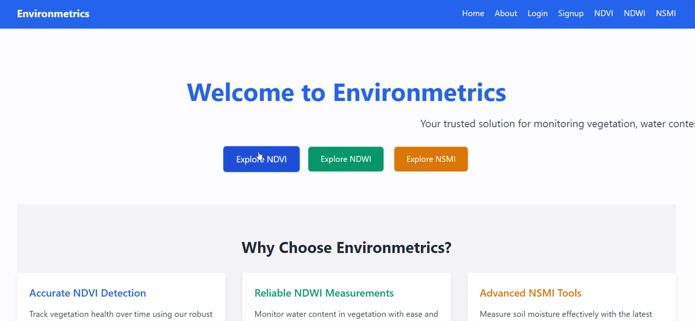
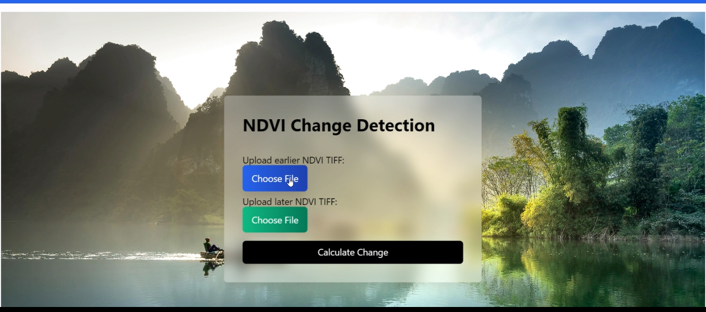
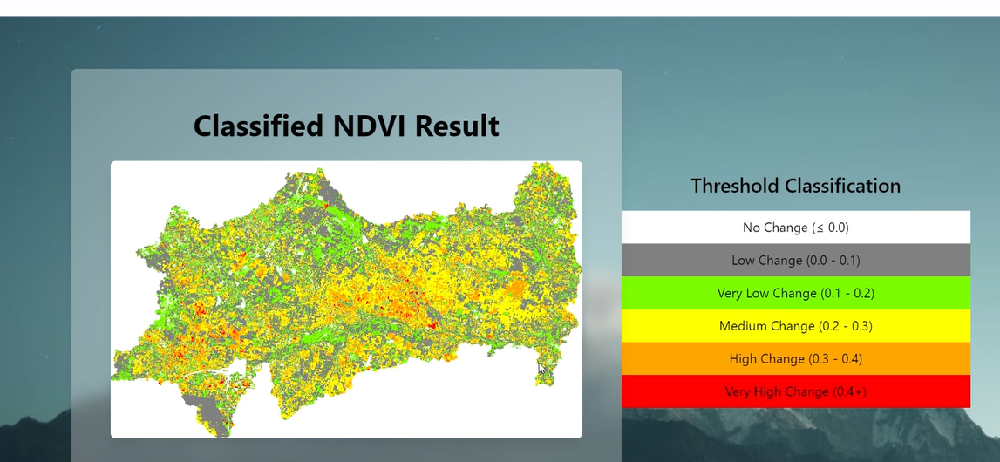

# Envirometircs
EnvironMetrics is a Flask-based web app for satellite image analysis. It calculates NDVI, NDWI, and NSMI from TIFF files and visualizes the results. The app supports user authentication and stores data in MongoDB. It also uses the Random Forest algorithm for NDVI, NDWI, and NSMI change map classification, with a clean UI built using Tailwind CSS.
# EnvironMetrics

**EnvironMetrics** is a Flask-based web application for satellite image analysis. It provides tools to calculate and visualize key vegetation and water indices from satellite TIFF images and classifies changes using machine learning.

---

## 🌐 Website Interface

---

## 🚀 Features

- 🌿 **NDVI (Normalized Difference Vegetation Index)** calculation  
- 💧 **NDWI (Normalized Difference Water Index)** calculation  
- 🌾 **NSMI (Normalized Soil Moisture Index)** calculation  
- 🗂️ **TIFF file upload and visualization**  
- 🧠 **Random Forest classification** of NDVI, NDWI, and NSMI change maps  
- 🔒 **User authentication** (Login/Signup)  
- 🛢️ **MongoDB** for data storage  
- 🎨 **Tailwind CSS** for a clean and responsive UI  

---

## 🧪 Sample Outputs

### 🌿 NDVI Change Detection  

### 🧠 RF Classification Result  

---

## 🛠️ Technologies Used

- **Python & Flask** – Backend logic & web framework  
- **MongoDB** – Database for user and file data  
- **Tailwind CSS** – Frontend UI styling  
- **Scikit-learn (Random Forest)** – Machine learning classification  
- **Leaflet.js** – Interactive map visualization  

---

## ⚠️ Disclaimer

This project is built for educational and research purposes only. The data and results produced by the system depend on the quality and scope of uploaded satellite images. This tool is **not intended for operational agricultural or environmental decision-making** without further validation.

---

## 📌 Usage

1. Clone the repository  
2. Create a virtual environment and install dependencies  
3. Run `python app.py`  
4. Upload satellite TIFF files and visualize results  

## 📜 License

MIT License
